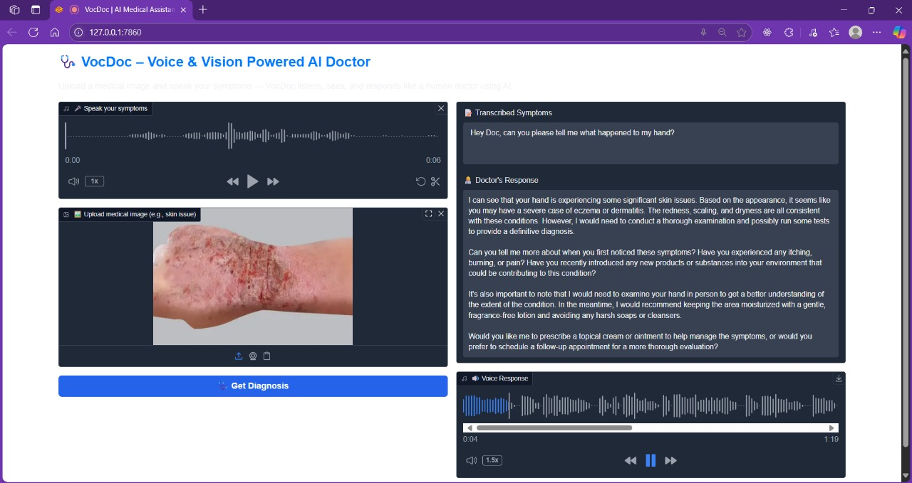

# 🩺 VocDoc – Voice & Vision Enabled AI Medical Assistant

**VocDoc** is a multimodal AI-powered assistant that lets users speak their symptoms and upload relevant medical images. The AI "doctor" provides a text-based and spoken diagnosis using advanced generative AI models.

---

## 🔍 Features

* 🎤 **Speech-to-Text (STT)** using OpenAI Whisper (via Groq API)
* 🖼️ **Image Analysis** using Meta LLaMA3 Vision (via Groq API)
* 🧠 **Doctor-like Response** using custom system prompts
* 🔊 **Text-to-Speech (TTS)** using gTTS or ElevenLabs
* 🌐 **Interactive UI** built with Gradio

---

## 📦 Tech Stack

| Layer        | Tools & APIs                             |
| ------------ | ---------------------------------------- |
| Language     | Python                                   |
| UI           | Gradio                                   |
| STT          | Whisper-large-v3 (via Groq)              |
| Image + Text | Meta LLaMA3 Vision (via Groq)            |
| TTS          | gTTS / ElevenLabs                        |
| Others       | dotenv, Pydub, FFmpeg, PortAudio, Pipenv |

---

## ⚙️ Setup Instructions

### 1. Clone the Repo

```bash
git clone https://github.com/yourusername/VocDoc.git
cd VocDoc
```

### 2. Setup Environment Variables

Create a `.env` file in the root folder:

```env
GROQ_API_KEY=your_groq_api_key

```

### 3. Install Dependencies

Using pipenv:

```bash
pipenv install
pipenv shell
```

Or manually:

```bash
pip install -r requirements.txt
```

### 4. Install FFmpeg and PortAudio (Windows users)

* FFmpeg: [https://ffmpeg.org/download.html](https://ffmpeg.org/download.html)
* PortAudio: Install via pip or wheel: `pip install PyAudio‑0.2.11‑cp311‑cp311‑win_amd64.whl`

---

## 🧪 How it Works – Modular Breakdown

| Phase | Module                    | Description                                |
| ----- | ------------------------- | ------------------------------------------ |
| 1     | `brain_of_the_doctor.py`  | Uses Groq + LLaMA to analyze medical image |
| 2     | `voice_of_the_patient.py` | Captures and transcribes patient's speech  |
| 3     | `voice_of_the_doctor.py`  | Converts AI doctor's response to voice     |
| 4     | `gradio_app.py`           | Unified UI for interaction                 |

---

## 🎨 UI Preview

> Speak your symptoms → Upload a photo → VocDoc listens and responds both as text and voice.

### 📸 Demo Screenshots

Here are a few snapshots of the VocDoc in action:




### 🔊 AI Doctor Voice Sample

[Download MP3](audio/final.mp3)


---

## 🌟 Project Inspiration

This project explores the power of **multimodal generative AI** in building empathetic, intelligent voice-enabled health assistants — paving the way for accessible and AI-assisted diagnostics.

---

## 🤖 Future Improvements

* Add multilingual support (e.g., Hindi)
* Save user history/logs
* Deploy to Hugging Face or Streamlit Cloud
* HIPAA/GDPR-safe sandbox mode

---

## 👩‍💻 Author

**Shriyanshi Gaur**
[LinkedIn](https://www.linkedin.com/in/shriyanshi-gaur-a4419428b) • [GitHub](https://github.com/shriyanshi-gaur)

---

## 📄 License

This project is for educational/demo purposes only. Not intended for real medical use.
